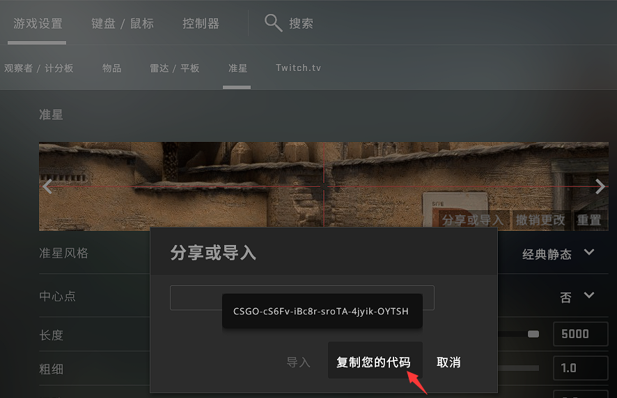
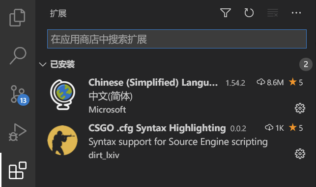
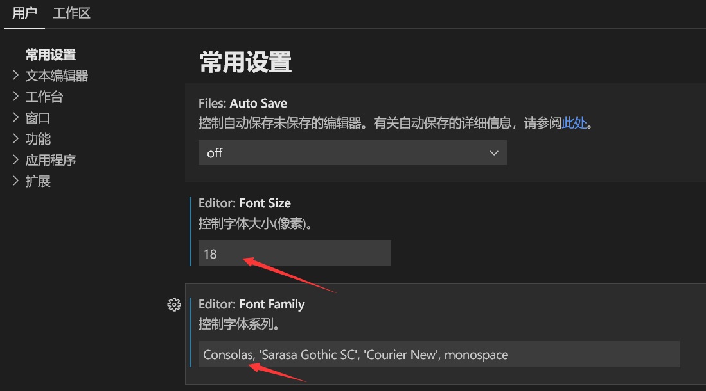
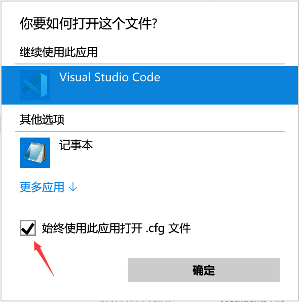

# CFG预设使用说明

Purp1e(@[Purple-CSGO](https://space.bilibili.com/73115492))制作

博客：https://purp1e.top/tag/csgo/  后期转移到 https://upup.cool

简书： https://www.jianshu.com/u/a29b25290dd7

控制台指令： https://tools.dathost.net/csgo-commands 

HLAE Studio： https://github.com/One-Studio/HLAE-Studio

CSGO工具箱： https://github.com/Purple-CSGO/CSGO-Toolbox-Qt

-- --

## **使用他人CFG之前不先看一遍说明、不备份CFG、不把所有CFG都浏览一遍的人是憨批！**

现在可以通过支付宝的方式来支持我啦~（请备注`CFG捐赠`）


----


-- --

## 导出准星和持枪的指令：

分开使用，一次复制一整行到控制台

```
echo ;echo "==================== 准星参数 ====================";echo ;developer 2;con_filter_enable 1;con_filter_text cl_crosshair;host_writeconfig;con_filter_text cl_fix;host_writeconfig;developer 0;con_filter_enable 0;

echo ;echo "==================== 持枪参数 ====================";echo ;developer 2;con_filter_enable 1;con_filter_text viewmodel;host_writeconfig;con_filter_text cl_bob;host_writeconfig;developer 0;con_filter_enable 0;
```

## 预设各文件作用简述：

> 通常游戏时使用

- **auto.cfg**
   核心cfg 包含若干常用设置指令并加以详尽注释 另有各种特殊功能的指令如跳投、投掷物准星
   
- **bind_default.cfg**
   还原初始键位的config 在auto demo hlae等cfg靠前位置调用此cfg 确保每次启动游戏键位一致
   
- **crosshair.cfg**
   存放**准星参数**的config 为了实现投掷物准星 单独成一个cfg可极大的保证投掷准星代码的可重用性
   
- **crosshair_throw.cfg**
   
   存放投掷物准星（超长十字准星）参数 配合投掷物准星功能
   
- **practice.cfg**
   **跑图**用cfg 方便跑图设置各种参数和键位绑定 控制台有中文提示
   
- **solo.cfg**
   进行solo 2v2 3v3等场景时使用的config 一次设置各种参数 另有设置solo模式的快捷键
   
- **demo.cfg**
   观看DEMO时使用的config 设置一些参数 绑定快捷按键

> 录制CSGO集锦素材（HLAE）时使用

- **hlae.cfg**
   搭配集锦制作工具**HLAE录制**素材时使用的config 包含各种参数键位设定如一键高亮玩家击杀信息
   
- **ffmpeg.cfg**
   搭配HLAE和FFMPEG**录制集锦素材**所用 已集成好录制预设 仅改变录制方式为ffmpeg
   
- **blocksound.cfg**
   使用HLAE时使用 可以屏蔽所有出语音外的声音 用来录制解说音轨
   
- **cals.cfg**
  
   搭配HLAE使用 实现自拍杆效果 附有若干预设
   
- **stream.cfg**

   搭配HLAE实现分层录制 已经集成好95%以上的指令 使用起来非常方便

> 其他

- **practiceExt.nut**

  本地跑图扩展脚本，需要放置在以下位置，加载practice.cfg后自动生效

  `..\Counter-Strike Global Offensive\csgo\scripts\vscripts`
  
- **启动项.txt**

  方便复制启动项

- **聊天轮盘指令清单.html**

- **武器购买代码.html**

- **更新日志.html**


## 使用说明：

#### 1. 不要急着使用
   **备份设置文件！备份设置文件！备份设置文件！**
  	 个人设置文件夹`...\Steam\userdata\(32位ID)\730\local\cfg\`
   	游戏设置文件夹`...\Steam\steamapps\common\Counter-Strike Global Offensive\csgo\cfg\`

> 32位->二进制位，大多8~10位十进制数字

#### 2. ID不知道怎么办？
- 登录 https://steamid.io/
- 复制个人资料简介，如 `https://steamcommunity.com/id/1234567890/`
- 第二行，如 SteamID3 [U:1:`146859713`]  得到ID `146859713`
- P.S 也可以先转移userdata下所有文件，登录你的steam，这时只会出现一个文件夹，文件夹名就是ID，记下这个ID，再把刚才转移的文件放回。

#### 3. 修改auto.cfg中的参数
- 可以把游戏设置成窗口模式对应着改
- 准星、持枪可以去创意工坊 auto中有说明
- 可用上文分享的指令导出准星和持枪参数

#### "注释" 在它出现的那一行，之后的内容都不会被读取

#### 5. //是"注释" 在它出现的那一行，之后的内容都不会被读取

```
这是指令;	//这是注释
```

   如果不想用某条指令，就在指令前加上注释，或者直接删除:

```
//这是指令;	//这是注释
```

#### 6. 准星分享或导入

控制台使用分享代码示例：

````
apply_crosshair_code CSGO-cS6Fv-iBc8r-sroTA-4jyik-OYTSH
````

#### 

#### 7. VSCode编辑器设置

推荐使用vscode编辑cfg文件，已经有大佬做好语法高亮插件。

1. 下载 [VSCode](https://code.visualstudio.com/)

2. 前往扩展安装中文和CFG插件并重启软件 

   

3. 按快捷键`Ctrl+,`设置字体字号，可设置`Consolas`这样的等宽字体，后面加上其他中文字体如更纱黑体、思源黑体、阿里巴巴普惠体（需要安装）

   

4. 找到一个CFG文件，右键->打开方式->选择其他应用，选择VSCode、勾选`始终是用此应用打开.cfg文件` 

   

## 常见问题:

####　1. 为什么我自己的cfg无法自动加载？
－　需要在这个cfg的结尾加上host_writeconfig
－　启动项 +exec xxx.cfg	是不是忘了+ 或者忘了用空格隔开？

> (xxx是自动加载cfg的名字)

####　2. 为什么控制台经常弹出unknown command
－　记事本编辑文件后编码格式会变为UTF8 Bom  而csgo无法识别bom
－　**对功能没影响** 可以用 editplus 或 vscode 改变编码为UTF8

